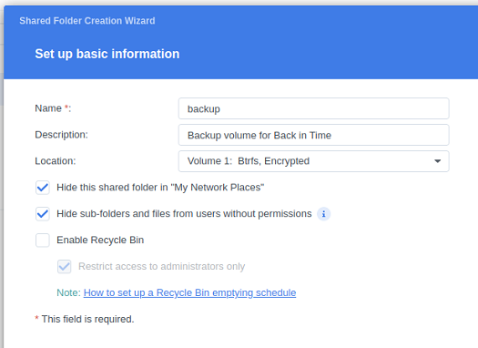
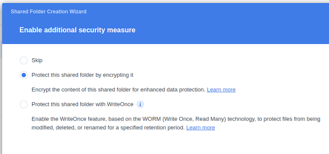

<!--
SPDX-FileCopyrightText: © 2022 Back In Time Team
SPDX-FileCopyrightText: © 2024 Paul Worrall (@Silver-Saucepan)

SPDX-License-Identifier: GPL-2.0-or-later

This file is part of the program "Back In Time" which is released under GNU
General Public License v2 (GPLv2). See LICENSES directory or go to
<https://spdx.org/licenses/GPL-2.0-or-later.html>
-->
<sub>January 2025</sub>

# FAQ - Frequently Asked Questions

<!-- TOC start (generated with https://github.com/derlin/bitdowntoc) -->

- [General](#general)
   * [Does _Back in Time_ support full system backups?](#does-back-in-time-support-full-system-backups)
   * [Does _Back in Time_ support backups on cloud storage like OneDrive or Google Drive?](#does-back-in-time-support-backups-on-cloud-storage-like-onedrive-or-google-drive)
   * [Where is the log file?](#where-is-the-log-file)
   * [How to read log entries?](#how-to-read-log-entries)
   * [How to move backups to a new hard-drive?](#how-to-move-backups-to-a-new-hard-drive)
   * [How to move a large directory in the backup source without duplicating the files in the backup?](#how-to-move-a-large-directory-in-the-backup-source-without-duplicating-the-files-in-the-backup)
   * [How does _Back In Time_ compare with _Timeshift_?](#how-does-back-in-time-compare-with-timeshift)
- [Backups (snapshots)](#backups-snapshots)
   * [Backup or Snapshot?](#backup-or-snapshot)
   * [Does _Back In Time_ create incremental or full backups?](#does-back-in-time-create-incremental-or-full-backups)
   * [How do backups with hard-links work?](#how-do-backups-with-hard-links-work)
   * [How can I check if my backups are using hard-links?](#how-can-i-check-if-my-backups-are-using-hard-links)
   * [How to use checksum to find corrupt files periodically?](#how-to-use-checksum-to-find-corrupt-files-periodically)
   * [What is the meaning of the leading 11 characters (e.g. "cf...p.....") in my backup logs?](#what-is-the-meaning-of-the-leading-11-characters-eg-cfp-in-my-backup-logs)
   * [Backup "WITH ERRORS": [E] 'rsync' ended with exit code 23: See 'man rsync' for more details](#backup-with-errors-e-rsync-ended-with-exit-code-23-see-man-rsync-for-more-details)
   * [What happens when I remove a backup?](#what-happens-when-i-remove-a-backup)
   * [How can I exclude cache folders to improve backup speed and reduce storage?](#how-can-i-exclude-cache-folders-to-improve-backup-speed-and-reduce-storage)
   * [How to use extended filesystem attributes (xattr) to exclude files/directories?](#how-to-use-extended-filesystem-attributes-xattr-to-exclude-filesdirectories)
- [Restore](#restore)
   * [After Restore I have duplicates with extension ".backup.20131121"](#after-restore-i-have-duplicates-with-extension-backup20131121)
   * [Back In Time doesn't find my old backups on my new Computer](#back-in-time-doesnt-find-my-old-backups-on-my-new-computer)
- [Schedule](#schedule)
   * [How does the 'Repeatedly (anacron)' schedule work?](#how-does-the-repeatedly-anacron-schedule-work)
   * [Will a scheduled backup run as soon as the computer is back on?](#will-a-scheduled-backup-run-as-soon-as-the-computer-is-back-on)
   * [If I edit my crontab and add additional entries, will that be a problem for BIT as long as I don't touch its entries? What does it look for in the crontab to find its own entries?](#if-i-edit-my-crontab-and-add-additional-entries-will-that-be-a-problem-for-bit-as-long-as-i-dont-touch-its-entries-what-does-it-look-for-in-the-crontab-to-find-its-own-entries)
   * [Can I use a systemd timer instead of cron?](#can-i-use-a-systemd-timer-instead-of-cron)
- [Problems, Errors & Solutions](#problems-errors--solutions)
   * [WARNING: A backup is already running](#warning-a-backup-is-already-running)
   * [_Back in Time_ does not start and shows: The application is already running! (pid: 1234567)](#back-in-time-does-not-start-and-shows-the-application-is-already-running-pid-1234567)
   * [Switching to dark or light mode in the desktop environment is ignored by BIT](#switching-to-dark-or-light-mode-in-the-desktop-environment-is-ignored-by-bit)
   * [Segmentation fault on Exit](#segmentation-fault-on-exit)
   * [Version >= 1.2.0 works very slow / Unchanged files are backed up](#version--120-works-very-slow--unchanged-files-are-backed-up)
   * [What happens if I hibernate the computer while a backup is running?](#what-happens-if-i-hibernate-the-computer-while-a-backup-is-running)
   * [What happens if I power down the computer while a backup is running, or if a power outage happens?](#what-happens-if-i-power-down-the-computer-while-a-backup-is-running-or-if-a-power-outage-happens)
   * [What happens if there is not enough disk space for the current backup?](#what-happens-if-there-is-not-enough-disk-space-for-the-current-backup)
   * [NTFS Compatibility](#ntfs-compatibility)
   * [GUI does not scale on high resolution or 4k monitors](#gui-does-not-scale-on-high-resolution-or-4k-monitors)
   * [Tray icon or other icons not shown correctly](#tray-icon-or-other-icons-not-shown-correctly)
   * [Non-working password safe and BiT forgets passwords (keyring backend issues)](#non-working-password-safe-and-bit-forgets-passwords-keyring-backend-issues)
   * [Incompatibility with rsync >= 3.2.4](#incompatibility-with-rsync-324-or-newer)
- [user-callback and other PlugIns](#user-callback-and-other-plugins)
   * [How to backup Debian/Ubuntu Package selection?](#how-to-backup-debianubuntu-package-selection)
   * [How to restore Debian/Ubuntu Package selection?](#how-to-restore-debianubuntu-package-selection)
- [Hardware-specific Setup](#hardware-specific-setup)
   * [How to use QNAP QTS NAS with BIT over SSH](#how-to-use-qnap-qts-nas-with-bit-over-ssh)
   * [How to use Synology DSM 5 with BIT over SSH](#how-to-use-synology-dsm-5-with-bit-over-ssh)
   * [How to use Synology DSM 6 with BIT over SSH](#how-to-use-synology-dsm-6-with-bit-over-ssh)
      * [Using a non-standard port](#using-a-non-standard-port)
   * [How to use Synology DSM 7 with BIT over SSH](#how-to-use-synology-dsm-7-with-bit-over-ssh)
     * [Using a non-standard SSH port with a Synology NAS](#using-a-non-standard-ssh-port-with-a-synology-nas)
     * ["sshfs: No such file or directory" using BIT, but manually ssh with rsync works](#sshfs-no-such-file-or-directory-using-bit-but-manually-ssh-with-rsync-works)
   * [Synology: use different volume for backup](#synology-use-different-volume-for-backup)
   * [How to use Western Digital MyBook World Edition with BIT over ssh?](#how-to-use-western-digital-mybook-world-edition-with-bit-over-ssh)
- [Project & Contributing & more](#project--Contributing--more)
   * [Which additional features on top of a GUI does BIT provide over a self-configured rsync backup? Are there additional benefits?](#which-additional-features-on-top-of-a-gui-does-bit-provide-over-a-self-configured-rsync-backup-are-there-additional-benefits)
   * [Support for specific package formats (deb, rpm, Flatpack, AppImage, Snaps, PPA, …)](#support-for-specific-package-formats-deb-rpm-flatpack-appimage-snaps-ppa-)
   + [Is BIT really not supported by Canonical Ubuntu?](#is-bit-really-not-supported-by-canonical-ubuntu)
   * [Move project to alternative code hoster (e.g. Codeberg, GitLab, …)](#move-project-to-alternative-code-hoster-eg-codeberg-gitlab-)
   * [How to review a Pull Request](#how-to-review-a-pull-request)
- [Testing & Building](#testing--building)
   * [SSH related tests are skipped](#ssh-related-tests-are-skipped)
   * [Setup SSH Server to run unit tests](#setup-ssh-server-to-run-unit-tests)

<!-- TOC end -->

# General

## Does _Back in Time_ support full system backups?

_Back in Time_ is suited for file-based backups.

A full system backup is neither supported nor recommended
(even though you could use _Back in Time (root)_ and include your
root folder `\`) because
- Mounted file systems (even remote locations)
- the backup needed to be done from within the running system
- Linux kernel special files (eg. /proc) must be excluded
- locked or open files (in an inconsistent state) must be handled
- backups of additional disk partitions (bootloader, EFI...) are required to be able to boot
- a restore cannot overwrite the running system (where the backups software is running)
  without the risk of crashes or losing data (for that a restore must be done from a separate boot device normally)
- ...

For full system backups look for
- a disk imaging ("cloning") solution (eg. [Clonezilla](https://clonezilla.org/))
- file-based backup tools that are designed for this (eg. [`Timeshift`](https://github.com/linuxmint/timeshift))

## Does _Back in Time_ support backups on cloud storage like OneDrive or Google Drive?

Cloud storage as backup source or target is not support because _Back in Time_
uses `rsync` as backend for file transfer and therefore a locally mounted file system
or a `ssh` connection is required. Neither is supported by cloud storage.

Even with native support for mounting a cloud storage, most of the time
it won't work because of limited support for 'special' file access
which is used by BiT (eg. Linux hardlinks, atime).

Typically "locally mounted" cloud storage uses a web-based API (REST-API)
which does not support `rsync`.

For a discussion about this topic see [Backup on OneDrive or Google Drive](https://github.com/bit-team/backintime/issues/1166).

## Where is the log file?

There are three distinct logs generated:

1. The _backup log_ contains messages specific to a particular backup at a
   given time. It is stored within each backup and can be accessed through
   the GUI.

2. The _restore log_ contains messages specific to a particular restore
   process. It is displayed in the GUI after each restore. It is also located
   in the folder `~/.local/share/backintime/` and is named `restore_.log` for
   the main profile, `restore_2.log` for the second, and so forth.

3. The _application log_ is generated using the syslog feature of the operating
   system. See [How to read log entries?](#how-to-read-log-entries) for
   further details.

## How to read log entries?

Both the _backup_ and _restore_ log files are plain text files and can be read
accordingly. Refer to [Where is the log file?](#where-is-the-log-file).
The _application_ log is generated via [syslog](https://en.wikipedia.org/wiki/Syslog)
using the identifier `backintime`. Depending on the version of _Back In time_ and the
GNU/Linux distribution used, there are three ways to get the log entries.

1. On modern systems:

    `journalctl --identifier backintime`

2. With an older _Back In Time_ version (1.4.2 or older):

    `journalctl --grep backintime`

3. If the error message `journalctl: command not found` appears, directly examine the syslog files:

    `sudo grep backintime /var/log/syslog`

## How to move backups to a new hard-drive?

There are three different solutions:

1. clone the drive with ``dd`` and enlarge the partition on the new drive to
   use all space. This will **destroy all data** on the destination drive!

   ```bash
    sudo dd if=/dev/sdbX of=/dev/sdcX bs=4M
   ```

   where ``/dev/sdbX`` is the partition on the source drive and ``/dev/sdcX`` is the destination drive

   Finally use ``gparted`` to resize the partition. Take a look at the
   [Ubuntu Docu](https://help.ubuntu.com/community/HowtoPartition/ResizingPartition) for more info on that.

1. copy all files using ``rsync -H``

   ```bash
    rsync -avhH --info=progress2 /SOURCE /DESTINATION
   ```

1. copy all files using ``tar``

   ```bash
   cd /SOURCE; tar cf - * | tar -C /DESTINATION/ -xf -
   ```

Make sure that your `/DESTINATION` contains a folder named `backintime`, which
contains all the backups. BiT expects this folder, and needs it to import
existing backups.

## How to move a large directory in the backup source without duplicating the files in the backup?

If you move a file/folder in the source ("include") location that is backed-up by BiT
it will treat this like a new file/folder and
create a new backup file for it (not hard-linked to the old one). With large
directories this can fill up your backup drive quite fast.

You can avoid this by moving the file/directory in the last backup too:

1. Create a new backup

2. Move the original directory

3. Manually move the same folder inside BiTs last backup in the same way you did with the original folder

4. Create a new backup

5. Remove the next to last backup (the one where you moved the directory
   manually) to avoid problems with permissions when you try to restore from
   that backup

## How does _Back In Time_ compare with _Timeshift_?

Back In Time and Timeshift are both Linux application that provides back up functionality.

1. Similarity
   - Both programs are backup tools for Linux and they create backups at a specific time.
   - For both programs, backups are taken using rsync and hard-links, while
   Common files are shared between backups which saves disk space.
   - Both programs support GUI and CLI
   - Both programs allow you to schedule regular backups. You can also disable
   scheduled backups completely and create backups manually when required

2. Back In Time
   - It is designed to protect user data including any folders or files.
   - It backs up certain folders and files that you want to protect. Modified files are transferred,
   while unchanged files are linked to the new folder. You can restore certain files and folders.
   - It's great for protecting your personal data

3. TimeShift
   - It is designed for system backups which allows restoring whole Linux system
   to a previous state without affecting any user data.
   - It backs up system files, not including any personal data unless user explicitly configured.
   - It's good for restoring your system after an update failure or configuration change.

# Backups (snapshots)

## Backup or Snapshot?
Until _Back In Time_ version 1.6.0 the term _snapshot_ was used, instead of
_backup_. Beginning with version 1.6.0 that term was rephrased into
_backup_. The reason was to not giving the impression that _Back In Time_ does
create images of storage volumes.

## Does _Back In Time_ create incremental or full backups?

Back In Time does use `rsync` and its `--hard-links` feature.
Because of that each backup is technically a full backup (contains each file)
but copies only the really changed files (to save disk space) and "reuses" unchanged
files by setting a so-called "hard-link".

In technical terms it is not an
[incremental backups](https://en.wikipedia.org/wiki/Incremental_backup).

## How do backups with hard-links work?

From the answer on Launchpad to the question
[_Does auto remove smart mode merge incremental backups?_](https://answers.launchpad.net/backintime/+question/123486)

If you create a new file on a Linux filesystem (e.g. ext3) the data will have a
unique number that is called inode. The path of the file is a link to this inode
(there is a database which stores which file point to which inode). Also every
inode has a counter for how many links point to this inode. After you created a
new file the counter is 1.

Now you make a new hardlink. The filesystem now just has to store the new path
pointing to the existing inode into the database and increase the counter of our
inode by 1.

If you remove a file than only the link from the path to that inode is removed
and the counter is decreased by 1. If you have removed all links to that inode
so the counter is zero the filesystem knows that it can override that block next
time you save a new file.

First time you create a new backup with BIT all files will have an inode
counter = 1.

#### backup0
| path   |   inode |   counter |
|:-------|--------:|----------:|
| fileA  |       1 |         1 |
| fileB  |       2 |         1 |
| fileC  |       3 |         1 |

Let's say you now change ``fileB``, delete ``fileC`` and have a new ``fileD``.
BIT first makes hardlinks of all files. ``rsync`` than delete all hardlinks of
files that has changed and copy the new files.

#### backup0
| path   |   inode |   counter |
|:-------|--------:|----------:|
| fileA  |       1 |         2 |
| fileB  |       2 |         1 |
| fileC  |       3 |         1 |


#### backup1
| path   |   inode |   counter |
|:-------|--------:|----------:|
| fileA  |       1 |         2 |
| fileB  |       4 |         1 |
| fileD  |       5 |         1 |

Now change ``fileB`` again and make a new backup

#### backup0
| path   |   inode |   counter |
|:-------|--------:|----------:|
| fileA  |       1 |         3 |
| fileB  |       2 |         1 |
| fileC  |       3 |         1 |

#### backup1
| path   |   inode |   counter |
|:-------|--------:|----------:|
| fileA  |       1 |         3 |
| fileB  |       4 |         1 |
| fileC  |       5 |         2 |

#### backup2
| path   |   inode |   counter |
|:-------|--------:|----------:|
| fileA  |       1 |         3 |
| fileB  |       6 |         1 |
| fileD  |       5 |         2 |


Finally smart-remove is going to remove **backup0**. All that is done by
smart-remove is to ``rm -rf`` (force delete everything) the whole directory
of **backup0**.

#### backup0 (no longer exist)
| path   |   inode |   counter |
|:-------|--------:|----------:|
| (empty)  |       1 |         2 |
| (empty)  |       2 |         0 |
| (empty)  |       3 |         0 |

#### backup1
| path   |   inode |   counter |
|:-------|--------:|----------:|
| fileA  |       1 |         2 |
| fileB  |       4 |         1 |
| fileD  |       5 |         2 |

#### backup2
| path   |   inode |   counter |
|:-------|--------:|----------:|
| fileA  |       1 |         2 |
| fileB  |       6 |         1 |
| fileD  |       5 |         2 |

``fileA`` is still untouched, ``fileB`` is still available in two different
versions and ``fileC`` is gone for good. The blocks on your hdd that stored the
data for inode 2 and 3 can now get overridden.

I hope this will shed a light on the "magic" behind BIT. If it's even more
confusing don't hesitate to ask ;)


## How can I check if my backups are using hard-links?

Please compare the inodes of a file that definitely didn't change between two
backups. For this open two terminals and ``cd`` into both backups directory.
``ls -lai`` will print a list where the first column is the inode which should
be equal for the same file in both backups if the file didn't change and the
backups are incremental. The third column is a counter (if the file is no
directory) on how many hard-links exist for this inode. It should be >1. So if
you took e.g. 3 backups it should be 3.

Don't be confused on the size of each backup. If you right click on
preferences for a backup in a file manager and look for its size, it will
look like they are all full backups (not incremental). But that's not
(necessary) the case.

To get the correct size of each backups with respect on the hard-links you
can run:

```bash
du -chd0 /media/<USER>/backintime/<HOST>/<USER>/1/*
```

Compare with option `-l` to count hardlinks multiple times:

```bash
du -chld0 /media/<USER>/backintime/<HOST>/<USER>/1/*
```

(``ncdu`` isn't installed by default so I won't recommend using it)

## How to use checksum to find corrupt files periodically?

Starting with BIT Version 1.0.28 there is a new command line option
``--checksum`` which will do the same as *Use checksum to detect changes* in
Options. It will calculate checksums for both the source and the last backups
files and will only use this checksum to decide whether a file has changed or
not. The normal mode (without checksums) is to compare modification times and sizes
of the files which is much faster to detect changed files.

Because this takes ages, you may want to use this only on Sundays or only the
first Sunday per month. Please deactivate the schedule for your profile in
that case. Then run ``crontab -e``

For daily backups on 2AM and ``--checksum`` every Sunday add:


```
# min hour day month dayOfWeek command
0 2 * * 1-6 nice -n 19 ionice -c2 -n7 /usr/bin/backintime --backup-job >/dev/null 2>&1
0 2 * * Sun nice -n 19 ionice -c2 -n7 /usr/bin/backintime --checksum --backup-job >/dev/null 2>&1
```

For ``--checksum`` only at first Sunday per month add:

```
# min hour day month dayOfWeek command
0 2 * * 1-6 nice -n 19 ionice -c2 -n7 /usr/bin/backintime --backup-job >/dev/null 2>&1
0 2 * * Sun [ "$(date '+\%d')" -gt 7 ] && nice -n 19 ionice -c2 -n7 /usr/bin/backintime --backup-job >/dev/null 2>&1
0 2 * * Sun [ "$(date '+\%d')" -le 7 ] && nice -n 19 ionice -c2 -n7 /usr/bin/backintime --checksum --backup-job >/dev/null 2>&1
```

Press <kbd>CTRL</kbd> + <kbd>O</kbd> to save and <kbd>CTRL</kbd> + <kbd>X</kbd> to exit
(if you editor is `nano`. Maybe different depending on your default text editor).

## What is the meaning of the leading 11 characters (e.g. "cf...p.....") in my backup logs?

This are from `rsync` and indicating what changed and why.  Please see the
section `--itemize-changes` in the
[manpage](https://download.samba.org/pub/rsync/rsync.1#opt--itemize-changes)
of `rsync`. See also some
[rephrased explanations on Stack Overflow](https://stackoverflow.com/a/36851784/4865723).

## Backup "WITH ERRORS": [E] 'rsync' ended with exit code 23: See 'man rsync' for more details

[BiT Version 1.4.0 (2023-09-14)](https://github.com/bit-team/backintime/releases/tag/v1.4.0)
introduced the **evaluation of `rsync` exit codes for better error recognition**:

Before this release `rsync` exit codes were ignored and only the backup
files parsed for errors (which does not find each error, eg. dead symbolic links
logged as `symlink has no referent`).

This "exit code 23" message may occur at the end of backup logs and BiT logs
when `rsync` was not able to transfer some (or even all) files. See
[this comment in issue 1587](https://github.com/bit-team/backintime/issues/1587#issuecomment-1856490208)
for a list all known reasons for `rsync`'s exit code 23.

Currently you can ignore this error after checking the full backup log which
error is hidden behind "exit code 23" (and possibly fix it - eg. delete or
update dead symbolic links).

We plan to implement an improved handling of exit code 23 in the future
(presumably by introducing warnings into the backup log).

## What happens when I remove a backup?

Each backup is stored in a dated subdirectory of the "full backup path"
shown in Settings.  It contains a ``backup`` directory of all the files as well
as a log of the backup's creation and some other details.  Removing the
backup removes this whole directory. Each backup is independent of the
others, so other backups are not affected. However, the data of identical files is
not stored redundantly by multiple backups, so removing a backup will only
recover the space used by files that are unique to that backup.

## How can I exclude cache folders to improve backup speed and reduce storage?

**Why exclude cache folders?**

Cache folders typically contain temporary files that are not necessary for backups.
Excluding them can significantly improve backup speed and reduce storage usage.

**How to exclude cache folders:**

1. Open Back in Time.
2. Go to the **Exclude Patterns** settings:
   - Click the "Exclude" tab in the configuration window.
   - Click the **Add** button to create a new exclude pattern.

3. Add the following patterns to exclude common cache directories:
   ```plaintext
   .var/app/**/[Cc]ache/
   .var/app/**/media_cache/
   .mozilla/firefox/**/cache/
   .config/BraveSoftware/Brave-Browser/Default/Service Worker/CacheStorage/
   ```

**Explanation**:

- `/**/` matches any directory structure leading to the specified folder.
- `[Cc]ache` matches folder names with either uppercase or lowercase "Cache."

4. Decide whether to include or exclude the folder itself:
   - To exclude only the folder’s content, use `/*` at the end of the pattern:
     ```plaintext
     .var/app/**/[Cc]ache/*
     ```
   - To exclude the folder and its contents, omit the `/*`:
     ```plaintext
     .var/app/**/[Cc]ache/
     ```

**Tips for better results:**

- **Check Backup Logs**:
  After running a backup, review the logs to identify additional folders that
  may slow down the process. Example log entries for cache files:
  ```plaintext
  [E] Skipping file /path/to/cache/file: Too many small files.
  ```

- **Customize Patterns**:
  Adjust the patterns to suit your specific applications. For example, modify
  paths for browsers or other software you use.

- **Test Exclude Patterns**:
  Test your backup after adding patterns to ensure they work as intended.

## How to use extended filesystem attributes (xattr) to exclude files/directories?
Please see [Issue #817](https://github.com/bit-team/backintime/issues/817) for
details.

## Are Samba shares supported? / Does Samba support hard links?
There is no short answer to that. It depends on the configuration of the Samba
server and the filesystem of the volume/harddisk it is using.

Generally it is not recommended to use Samba shares as backup destination. Use
an SSH profile instead.

Further reading:
- https://superuser.com/q/855946/486099
- https://github.com/bit-team/backintime/issues/1883

If you encounter clear rules about configuring Samba that it works with
_Back In Time_ in a reliable way, please let us know the details. We will than
integrate it into the documentation.

# Restore

## After Restore I have duplicates with extension ".backup.20131121"

This is because *Backup files on restore* in Options was enabled. This is
the default setting to prevent overriding files on restore.

If you don't need them any more you can delete those files. Open a terminal
and run:

```bash
find /path/to/files -regextype posix-basic -regex ".*\.backup\.[[:digit:]]\{8\}"
```

Check if this correctly listed all those files you want to delete and than run:

```bash
find /path/to/files -regextype posix-basic -regex ".*\.backup\.[[:digit:]]\{8\}" -delete
```

## Back In Time doesn't find my old backups on my new Computer

Back In Time prior to version 1.1.0 had an option called
*Auto Host/User/Profile ID* (hidden under *General* > *Advanced*) which will
always use the current host- and username for the full backup path.
When (re-)installing your computer you probably chose a different host name or
username than on your old machine. With *Auto Host/User/Profile ID* activated
Back In Time now try to find your backups under the new host- and username
underneath the ``/path/to/backintime/`` path.

The *Auto Host/User/Profile ID* option is gone in version 1.1.0 and above.
It was totally confusing and didn't add any good.

You have three options to fix this:

- Disable *Auto Host/User/Profile ID* and change *Host* and *User* to match
  your old machine.

- Rename the backups path
  ``/path/to/backintime/OLDHOSTNAME/OLDUSERNAME/profile_id`` to match your new
  host- and username.

- Upgrade to a more recent version of Back In Time (1.1.0 or above).
  The *Auto Host/User/Profile ID* option is gone and it also comes with
  an assistant to restore the config from an old backup on first start.


# Schedule

## How does the 'Repeatedly (anacron)' schedule work?

In fact *Back In Time* doesn't use anacron anymore. It was to inflexible. But that
schedule mimics anacron.

BIT will create a crontab entry which will start ``backintime --backup-job``
every 15min (or once an hour if the schedule is set to *weeks*). With the
``--backup-job`` command, BIT will check if the profile is supposed to be run
this time or exit immediately. For this it will read the time of the last
successful run from ``~/.local/share/backintime/anacron/ID_PROFILENAME``.
If this is older than the configured time, it will continue creating a backup.

If the backup was successful without errors, BIT will write the current time
into ``~/.local/share/backintime/anacron/ID_PROFILENAME`` (even if *Repeatedly
(anacron)* isn't chosen). So, if there was an error, BIT will try again at
the next quarter hour.

``backintime --backup`` will always create a new backup. No matter how many
time elapsed since last successful backup.

## Will a scheduled backup run as soon as the computer is back on?

Depends on which schedule you choose:

- the schedule ``Repeatedly (anacron)`` will use an anacron-like code. So if
  your computer is back on it will start the job if the given time is gone till
  last backup.

- with ``When drive get connected (udev)`` *Back In Time* will start a backup
  as soon as you connect your drive ;-)

- old fashion schedules like ``Every Day`` will use cron. This will only start a
  new backup at the given time. If your computer is off, no backup will be
  created.

## If I edit my crontab and add additional entries, will that be a problem for BIT as long as I don't touch its entries? What does it look for in the crontab to find its own entries?

You can add your own crontab entries as you like. *Back In Time* will not touch them.
It will identify its own entries by the comment line ``#Back In Time system
entry, this will be edited by the gui:`` and the following command. You should
not remove/change that line. If there are no automatic schedules defined
*Back In Time* will add an extra comment line ``#Please don't delete these two
lines, or all custom backintime entries are going to be deleted next time you
call the gui options!`` which will prevent *Back In Time* to remove user defined
schedules.

## Can I use a systemd timer instead of cron?

While there is no support within *Back In Time* to directly create a systemd
timer, users can create a user timer and service units. Templates are provided
below. Optionally adjust the value for `OnCalendar=` with a valid setting. See
[`man systemd.timer`](https://manpages.debian.org/testing/systemd/systemd.timer.5)
for more.

**Timer**:
```ini
# ~/.config/systemd/user/backintime-backup-job.timer
[Unit]
Description=Start a backintime backup once daily

[Timer]
OnCalendar=daily
AccuracySec=1m
Persistent=true

[Install]
WantedBy=timers.target
```

**Service**:
```ini
# ~/.config/systemd/user/backintime-backup-job.service
[Unit]
Description=Run backintime backup generation

[Service]
Type=oneshot
ExecStart=/usr/bin/nice -n19 /usr/bin/ionice -c2 -n7 /usr/bin/backintime backup-job
```

# Problems, Errors & Solutions
## WARNING: A backup is already running
_Back In Time_ uses signal files like `worker<PID>.lock` to avoid starting the same backup twice.
Normally it is deleted as soon as the backup finishes. In some case something went wrong
so that _Back In Time_ was forcefully stopped without having the chance to delete
this signal file.

Since _Back In Time_ does only start a new backup job (for the same profile) if the signal
file does not exist, such a file need to be deleted first. But before this is done manually,
it must be ensured that _Back In Time_ really is not running anymore. It can be ensured via

```bash
ps aux | grep -i backintime
```

If the output shows a running instance of _Back In Time_ it must be waited until it finishes
or killed via `kill <process id>`.

For more details see the developer documentation: [Usage of control files (locks, flocks, logs and others)](doc/maintain/4_Control_files_usage_(locks_flocks_logs_and_others).md)

## _Back in Time_ does not start and shows: The application is already running! (pid: 1234567)
This message occurs when _Back In Time_ is either already running or did not finish regularly (e.g. due to a crash)
and wasn't able to delete its application lock file.

Before deleting that file manually make sure no backintime process is running
via `ps aux | grep -i backintime`.
Otherwise, kill the process. After that look into the folder
`~/.local/share/backintime` for the file `app.lock.pid` and delete it.

For more details see the developer documentation: [Usage of control files (locks, flocks, logs and others)](doc/maintain/4_Control_files_usage_(locks_flocks_logs_and_others).md)

## Switching to dark or light mode in the desktop environment is ignored by BIT
After restart _Back In Time_ it should adapt to the desktops current used
color theme.

It happens because Qt does not detect theme modifications out of the
box. [Workarounds are known](https://stackoverflow.com/q/75457687), but
generate a relatively large amount of code and in our opinion are not worth
the effort.

## Segmentation fault on Exit
This problem existed at least since version 1.2.1, and will hopefully be fixed
with version 1.5.0. For all affected versions, it does not impact the
functionality of _Back In Time_ or jeopardize backup integrity. It can be
safely ignored.

See also:
- [#1768](https://github.com/bit-team/backintime/pull/1768)
- [#1095](https://github.com/bit-team/backintime/issues/1095)

## Version >= 1.2.0 works very slow / Unchanged files are backed up

After updating to >= 1.2.0, BiT does a (nearly) full backup because file
permissions are handled differently. Before 1.2.0 all destination file
permissions were set to `-rw-r--r--`. In 1.2.0 rsync is executed with `--perms`
option which tells rsync to preserve the source file permission.
That's why so many files seem to be changed.

If you don't like the new behavior, you can use "Expert Options"
-> "Paste additional options to rsync" to add the value
`--no-perms --no-group --no-owner` in that field.

## What happens if I hibernate the computer while a backup is running?

*Back In Time* will inhibit automatic suspend/hibernate while a backup/restore
is running. If you manually force hibernate this will freeze the current
process.  It will continue as soon as you wake up the system again.

## What happens if I power down the computer while a backup is running, or if a power outage happens?

This will kill the current process. The new backup will stay in
``new_snapshot`` folder. Depending on which state the process was while killing
the next scheduled backup can continue the leftover ``new_snapshot`` or it will
remove it first and start a new one.

## What happens if there is not enough disk space for the current backup?

*Back In Time* will try to create a new backup but rsync will fail when there
is not enough space. Depending on ``Continue on errors`` setting the failed
backup will be kept and marked ``With Errors`` or it will be removed.  By
default, *Back In Time* will finally remove the oldest backups until there is
more than 1 GiB free space again.

## NTFS Compatibility
Although devices formatted with the NTFS file system can generally be used with
*Back In Time*, there are some limitations to be aware of.

NTFS File systems do not support the following characters in filenames or directories:

```text
< (less than)
> (greater than)
: (colon)
" (double quote)
/ (forward slash)
\ (backslash)
| (vertical bar or pipe)
? (question mark)
* (asterisk)
```

If *Back In Time* tries to copy files where the filename contains those
character, an "Invalid argument (22)" error message will be displayed.

It is recommended that only devices formatted with Unix style file systems
(such as ext4) be used.

For more information, refer to [this Microsoft page](https://learn.microsoft.com/en-us/windows/win32/fileio/naming-a-file#naming-conventions).

## GUI does not scale on high resolution or 4k monitors
The technical details are complex and many components of the operating system
are involved. BIT itself is not involved and also not responsible for
it. Several approaches might help:
- Check your desktop environment or window manager for settings regarding
  scaling.
- Because BIT is using Qt for its GUI, modifying the environment variable
  `QT_SCALE_FACTOR` or `QT_AUTO_SCREEN_SCALE_FACTOR`.
  See [this article](https://doc.qt.io/qt-6/highdpi.html) and
  [Issue #1946](https://github.com/bit-team/backintime/issues/1946) about more
  details.
## Tray icon or other icons not shown correctly

**Status: Fixed in v1.4.0**

Missing installations of Qt-supported themes and icons can cause this effect.
_Back In Time_ may activate the wrong theme in this
case leading to some missing icons. A fix for the next release is in preparation.

As clean solution, please check your Linux settings (Appearance, Styles, Icons)
and install all themes and icons packages for your preferred style via
your package manager.

See issues [#1306](https://github.com/bit-team/backintime/issues/1306)
and [#1364](https://github.com/bit-team/backintime/issues/1364).

## Non-working password safe and BiT forgets passwords (keyring backend issues)

**Status: Fixed in v1.3.3 (mostly) and v1.4.0**

_Back in Time_ does only support selected "known-good" backends
to set and query passwords from a user-session password safe by
using the [`keyring`](https://github.com/jaraco/keyring) library.

Enabling a supported keyring requires manual configuration of a configuration
file until there is e.g. a settings GUI for this.

Symptoms are DEBUG log output (with the command line argument `--debug`) of
keyring problems can be recognized by output like:

```
DEBUG: [common/tools.py:829 keyringSupported] No appropriate keyring found. 'keyring.backends...' can't be used with BackInTime
DEBUG: [common/tools.py:829 keyringSupported] No appropriate keyring found. 'keyring.backends.chainer' can't be used with BackInTime
```

To diagnose and solve this follow these steps in a terminal:

```
# Show default backend
python3 -c "import keyring.util.platform_; print(keyring.get_keyring().__module__)"

# List available backends:
keyring --list-backends

# Find out the config file folder:
python3 -c "import keyring.util.platform_; print(keyring.util.platform_.config_root())"

# Create a config file named "keyringrc.cfg" in this folder with one of the available backends (listed above)
[backend]
default-keyring=keyring.backends.kwallet.DBusKeyring
```

See also issue [#1321](https://github.com/bit-team/backintime/issues/1321)

## Incompatibility with rsync 3.2.4 or newer

**Status: Fixed in v1.3.3**

The release (`1.3.2`) and earlier versions of _Back In Time_ are incompatible
with `rsync >= 3.2.4`
([#1247](https://github.com/bit-team/backintime/issues/1247)).

If you use `rsync >= 3.2.4` and `backintime <= 1.3.2` there is a
workaround. Add `--old-args` in
[_Expert Options_ / _Additional options to rsync_](https://backintime.readthedocs.io/en/latest/settings.html#expert-options).
Note that some GNU/Linux distributions (e.g. Manjaro) using a workaround with
environment variable `RSYNC_OLD_ARGS` in their distro-specific packages for
_Back In Time_. In that case you may not see any problems.

# user-callback and other PlugIns

## How to backup Debian/Ubuntu Package selection?

There is a [user-callback example](https://github.com/bit-team/user-callback/blob/master/user-callback.apt-backup)
which will backup all package
selections, sources and repository keys which are necessary to reinstall exactly
the same packages again. It will even backup whether a package was installed
manually or automatically because of dependencies.

Download the script, copy it to ``~/.config/backintime/user-callback`` and make
it executable with ``chmod 755 ~/.config/backintime/user-callback``

It will run every time a new backup is taken. Make sure to include
``~/.apt-backup``.

## How to restore Debian/Ubuntu Package selection?

If you made backups including apt-get package selection as described in the
FAQ "`How to backup Debian/Ubuntu Package selection?`_" you can easily restore
your system after a disaster/on a new machine.

1. install Debian/Ubuntu on your new hard drive as usual

1. install backintime-qt4 from our PPA

   ```bash
    sudo add-apt-repository ppa:bit-team/stable
    sudo apt-get update
    sudo apt-get install backintime-qt4
   ```

1. connect your external drive with the backups

1. Start *Back In Time*. It will ask you if you want to restore your
   config. Sure you want! *Back In Time* should find your backups
   automatically. Just select the one from which you want to
   restore the config and click Ok.

1. restore your home

1. recreate your ``/etc/apt/sources.list`` if you had something
   special in there. If your Debian/Ubuntu version changed don't
   just copy them from ``~/.apt-backup/sources.list``

1. copy your repositories with

   ```bash
    sudo cp ~/.apt-backup/sources.list.d/* /etc/apt/sources.list.d/
   ```

1. restore apt-keys for your PPAs with

   ```bash
    sudo apt-key add ~/.apt-backup/repo.keys
   ```

1. install and update `dselect` with

   ```bash
    sudo apt-get install dselect
    sudo dselect update install
   ```

1. Make some *housecleaning* in ``~/.apt-backup/package.list``.
   For example, you don't want to install the old kernel again.
   So run

   ```bash
    sed -e "/^linux-\(image\|headers\)/d" -i ~/.apt-backup/package.list
   ```

1. install your old packages again with

   ```bash
    sudo apt-get update
    sudo dpkg --set-selections < ~/.apt-backup/package.list
    sudo apt-get dselect-upgrade
   ```

1. If you used the new script which uses apt-mark to backup
   package selection proceed with next step. (there should be
   files ``~/.apt-backup/pkg_auto.list`` and ``~/.apt-backup
   /pkg_manual.list``). Otherwise, you can stop here.
   Restore package selection with

   ```bash
    sudo apt-mark auto $(cat ~/.apt-backup/pkg_auto.list)
    sudo apt-mark manual $(cat ~/.apt-backup/pkg_manual.list)
   ```


# Hardware-specific Setup

## How to use QNAP QTS NAS with BIT over SSH

To use *BackInTime* over SSH with a QNAP NAS there is still some work to be done
 in the terminal.

**WARNING**:
DON'T use the changes for ``sh`` suggested in ``man backintime``. This will
damage the QNAP admin account (and even more). Changing ``sh`` for another user
doesn't make sense either because SSH only works with the QNAP admin account!

Please test this Tutorial and give some feedback!

1. Activate the SSH prefix: ``PATH=/opt/bin:/opt/sbin:\$PATH`` in ``Expert
   Options``

1. Use ``admin`` (default QNAP admin) as remote user. Only this user can connect
   through SSH. Also activate on the QNAP `SFTP` on the SSH settings page.

1. Path should be something like ``/share/Public/``

1. Create the public/private key pair for the password-less login with the user
   you use for *BackInTime* and copy the public key to the NAS.

   ```bash
   ssh-keygen -t rsa
   ssh-copy-id -i ~/.ssh/id_rsa.pub  <REMOTE_USER>@<HOST>
   ```

To fix the message about not supported ``find PATH -type f -exec`` you need to
install ``Entware-ng``. QNAPs QTS is based on Linux but some of its packages
have limited functionalities. And so do some of the necessary ones for
*BackInTime*.

Please follow [this install instruction](https://github.com/Entware-ng/Entware-ng/wiki/Install-on-QNAP-NAS)
to install ``Entware-ng`` on your QNAP NAS.

Because there is no web interface yet for ``Entware-ng``, you must configure it
by SSH on the NAS.

Some Packages will be installed by default for example ``findutils``.

Login on the NAS and updated the Database and Packages of ``Entware-ng`` with

   ```bash
   ssh <REMOTE_USER>@<HOST>
   opkg update
   opkg upgrade
   ```

Finally install the current packages of ``bash``, ``coreutils`` and ``rsync``

   ```bash
   opkg install bash coreutils rsync
   ```

Now the error message should be gone and you should be able to take a first
backup with *BackInTime*.

*BackInTime* changes permissions on the backup path. The owner of the
backup has read permission, other users have no access.

This way can change with newer versions of *BackInTime* or QNAPs QTS!

## How to use Synology DSM 5 with BIT over SSH

**Issue**

*BackInTime* cannot use Synology DSM 5 directly because the SSH connection to the
NAS refers to a different root file system than SFTP does. With SSH you access
the real root, with SFTP you access a fake root (`/volume1`)

**Solution**

Mount `/volume1/backups` to `/volume1/volume1/backups`

**Suggestion**

DSM 5 isn't really up to date any more and might be a security risk. It is
strongly advised to upgrade to DSM 6! Also the setup with DSM 6 is much easier!

1. Make a new volume named ``volume1`` (should already exist, else create it)

1. Enable User Home Service (Control Panel / User)

1. Make a new share named ``backups`` on ``volume1``

1. Make a new share named ``volume1`` on ``volume1`` (It must be the same name)

1. Make a new user named ``backup``

1. Give to user ``backup`` rights Read/Write to share ``backups`` and
   ``volume1`` and also permission for FTP

1. Enable SSH (Control Panel / Terminal & SNMP / Terminal)

1. Enable SFTP (Control Panel / File Service / FTP / SFTP)

1. Enable rsync service (Control Panel / File Service / rsync)

1. Since DSM 5.1: Enable Backup Service (Backup & Replication / Backup Service)
   (This seems not to be available/required anymore with DSM 6!)

1. Log on as root by SSH

1. Modify the shell of user ``backup``. Set it to ``/bin/sh`` (``vi /etc/passwd`` then
   navigate to the line that begins with ``backup``, press :kbd:`I` to enter ``Insert
   Mode``, replace ``/sbin/nologin`` with ``/bin/sh``, then finally save and exit by
   pressing :kbd:`ESC` and type ``:wq`` followed by :kbd:`Enter`) This step might have
   to be repeated after a major update of the Synology DSM!  Note: This is
   quite a dirty hack! It is suggested to upgrade to DSM 6 which doesn't need
   this any more!

1. Make a new directory ``/volume1/volume1/backups``


   ```bash
   mkdir /volume1/volume1/backups
   ```

1. Mount ``/volume1/backups`` on ``/volume1/volume1/backups``

   ```bash
   mount -o bind /volume1/backups /volume1/volume1/backups
   ```

1. To auto-mount it make a script ``/usr/syno/etc/rc.d/S99zzMountBind.sh``


   ```bash
   #!/bin/sh

    start()
    {
           /bin/mount -o bind /volume1/backups /volume1/volume1/backups
    }

    stop()
    {
           /bin/umount /volume1/volume1/backups
    }

    case "$1" in
           start) start ;;
           stop) stop ;;
           *) ;;
    esac
    ```

   Note: If the folder ``/usr/syno/etc/rc.d`` doesn't exist, check if
   ``/usr/local/etc/rc.d/`` exists. If so, put it there. (After I updated to
   Synology DSM 6.0beta, the first one did not exist anymore). Make sure the
   execution flag of the file is checked , else it will not get run at start! To
   make it executable, run: ``chmod +x /usr/local/etc/rc.d/S99zzMountBind.sh``

1. On the workstation on which you try to use BIT make SSH keys for user
   ``backup``, send the public key to the NAS

   ```bash
   ssh-keygen -t rsa -f ~/.ssh/backup_id_rsa
   ssh-add ~/.ssh/backup_id_rsa
   ssh-copy-id -i ~/.ssh/backup_id_rsa.pub backup@<synology-ip>
   ssh backup@<synology-ip>
   ```

1. You might get the following error:

   ```bash
   /usr/bin/ssh-copy-id: INFO: attempting to log in with the new key(s), to filter out any that are already installed
   /usr/bin/ssh-copy-id: WARNING: All keys were skipped because they already exist on the remote system.
   ```

1. If so, copy the public key manually to the NAS as root with

   ```bash
   scp ~/.ssh/id_rsa.pub backup@<synology-ip>:/var/services/homes/backup/
   ssh backup@<synology-ip> cat /var/services/homes/backup/id_rsa.pub >> /var/services/homes/backup/.ssh/authorized_keys
   # you'll still be asked for your password on these both commands
   # after this you should be able to login password-less
   ```

1. And proceed with the next step

1. If you are still prompted for your password when running ``ssh
   backup@<synology-ip>``, check the permissions of the file
   ``/var/services/homes/backup/.ssh/authorized_keys``.  It should be
   ``-rw-------``.  If this is not the case, run the command

   ```bash
   ssh backup@<synology-ip> chmod 600 /var/services/homes/backup/.ssh/authorized_keys
   ```

1. Now you can use *BackInTime* to perform your backup to your NAS with the user
   ``backup``.

## How to use Synology DSM 6 with BIT over SSH

1. Enable User Home Service (Control Panel / User / Advanced). There is no need
   to create a volume since everything is stored in the home directory.

1. Make a new user named ``backup`` (or use your existing account). Add this user
   to the user group ``Administrators``. Without this, you will not be able to log
   in!

1. Enable SSH (Control Panel / Terminal & SNMP / Terminal)

1. Enable SFTP (Control Panel / File Service / FTP / SFTP)

1. Since DSM 5.1: Enable Backup Service (Backup & Replication / Backup Service)
   (This seems not to be available/required anymore with DSM 6!) (Tests needed!)

1. On DSM 6 you can edit the user-root-dir for sFTP: Control Panel -> File
   Services -> FTP -> General -> Advanced Settings -> Security Settings ->
   Change user root directories -> Select User. Now select the user ``backup`` and
   Change root directory to ``User home``

1. On the workstation on which you try to use BIT make SSH keys for user
   ``backup``, send the public key to the NAS

   ```bash
	ssh-keygen -t rsa -f ~/.ssh/backup_id_rsa
	ssh-add ~/.ssh/backup_id_rsa
	ssh-copy-id -i ~/.ssh/backup_id_rsa.pub backup@<synology-ip>
	ssh backup@<synology-ip>
   ```

1. You might get the following error:

   ```bash
	/usr/bin/ssh-copy-id: INFO: attempting to log in with the new key(s), to filter out any that are already installed
	/usr/bin/ssh-copy-id: WARNING: All keys were skipped because they already exist on the remote system.
   ```

1. If so, copy the public key manually to the NAS as root with

   ```bash
    scp ~/.ssh/id_rsa.pub backup@<synology-ip>:/var/services/homes/backup/
    ssh backup@<synology-ip> cat /var/services/homes/backup/id_rsa.pub >> /var/services/homes/backup/.ssh/authorized_keys
    # you'll still be asked for your password on these both commands
    # after this you should be able to login password-less
   ```

1. And proceed with the next step

1. If you are still prompted for your password when running ``ssh
   backup@<synology-ip>``, check the permissions of the file
   ``/var/services/homes/backup/.ssh/authorized_keys``.  It should be
   ``-rw-------``.  If this is not the case, run the command

   ```bash
   ssh backup@<synology-ip> chmod 600 /var/services/homes/backup/.ssh/authorized_keys
   ```

1. In *BackInTime* settings dialog leave the *Path* field empty

1. Now you can use *BackInTime* to perform your backup to your NAS with the user
   ``backup``.

### Using a non-standard port

If you want to use the Synology NAS with non-standard SSH/SFTP port
(standard is 22), you have to change the Port on total 3 places:

1. Control Panel > Terminal: Port = <PORT_NUMBER>

1. Control Panel > FTP > SFTP: Port = <PORT_NUMBER>

1. Backup & Replication > Backup Services > Network Backup Destination: SSH
   encryption port = <PORT_NUMBER>

Only if all 3 of them are set to the same port, *BackInTime* is able to
establish the connection. As a test, one can run the command

   ```bash
   rsync -rtDHh --checksum --links --no-p --no-g --no-o --info=progress2 --no-i-r --rsh="ssh -p <PORT_NUMBER> -o IdentityFile=/home/<USER>/.ssh/id_rsa" --dry-run --chmod=Du+wx /tmp/<AN_EXISTING_FOLDER> "<USER_ON_DISKSTATION>@<SERVER_IP>:/volume1/Backups/BackinTime"
   ```

in a terminal (on the client PC).

## How to use Synology DSM 7 with BIT over SSH

1. Enable *User Home Service* (Control Panel > User & Group > Advanced).

1. Make a new user named ``backup`` (or use your existing account) and add this
user to the user group ``Administrators``.

1. Enable *SSH* (Control Panel > Terminal & SNMP > Terminal)

1. Enable *SFTP* (Control Panel > File Services > FTP > SFTP)

1. Enable *rsync* (Control Panel > File Services > rsync)

1. Edit the user-root-directory for SFTP: Control Panel > File Services > FTP >
General > Advanced Settings > Security Settings > Change user root directories >
Select User > select the user ``backup`` > Edit and Change root directory to ``User
home``

1. Make sure the 'homes' shared folder has the default permissions and that
   non-admin users and groups are not assigned Read or Write permissions on the
   'homes' folder. The default permissions are described in [this guide](https://kb.synology.com/DSM/tutorial/default_permissions_of_homes)

1. On the workstation on which you need to use BIT, make an SSH key pair for
   user ``backup``, and send the public key to the NAS:

   ```bash
	ssh-keygen -t rsa -f ~/.ssh/backup_id_rsa
	ssh-copy-id -i ~/.ssh/backup_id_rsa.pub backup@<synology-ip>
	ssh backup@<synology-ip>
   ```

1. Although not strictly necessary, Synology recommend setting the permissions
   for the `.ssh` directory and the `authorized_keys` file to `700`, and `600`
   respectively:

    ```bash
    backup@NAS:~$ chmod 700 .ssh
    backup@NAS:~$ chmod 600 .ssh/authorized_keys
	```
1. In *BackInTime* settings dialog leave the *Path* field empty

1. Now you can use *BackInTime* to perform your backup to your NAS with the user
``backup``.

### Using a non-standard SSH port with a Synology NAS

If you want to use the Synology NAS with a non-standard SSH/SFTP port as advised
by the Security Advisor package, you have to change the Port in 3 places (the
default port number for all three is 22):

1. Control Panel > Terminal & SNMP > Terminal: Port = <PORT_NUMBER>

1. Control Panel > File Services > FTP > SFTP: Port number = <PORT_NUMBER>

1. Control Panel > File Services > rsync > SSH encryption port = <PORT_NUMBER>

Only if all 3 are set to the same port is *BackInTime* able to establish the
connection (don't forget to set the new port number in the BIT profiles).

To sign in with ssh using the new port number:

  ```bash
  ssh -p PORT_NUMBER backup@<synology-ip>
  ```

or, for convenience you can edit or create ``~/.ssh/config`` with the following:

  ```
  Host <synology-ip>
      Port PORT_NUMBER
  ```

and then use just:

  ```bash
  ssh backup@<synology-ip>
  ```

### "sshfs: No such file or directory" using BIT, but manually ssh with rsync works
The reason (known for DSM version 7) is that the setup of ssh and sftp is
customized by Synology.

Solution ([Screenshot in Issue #1674](https://github.com/bit-team/backintime/issues/1674#issuecomment-2106059151)):
1. Go to: _Control Panel_ > _File Services_ > _Advanced Settings_ > _Change user root directories_ > _Select User_
2. Add the name of the user used for SSH on the Synology in that list.
3. At _Change root directory to:_ select _User home_.

See also
- [Issue #1674](https://github.com/bit-team/backintime/issues/1674)
- ["Change the default folder in a Synology NAS" - StackOverflow](https://stackoverflow.com/a/77454561/4865723)

## Synology: use different volume for backup

This was tested and related to Synology DSM version 7, but might work with
other versions, too. Feel free to report back.

If you want to use a different volume as the destination for the backup use
these additional steps:

1. Follow all steps under **Howto (like create additional user in the example
   name of the user 'backup')
2. Create in the Synology DSM GUI in Control panel a new shared folder name it
   "backup" for example

   

3. Optional in step-2 Enable shared folder encryption (Depending on your needs,
   don't loose your encryption key) Advantage: backup folder (volume) is
   encrypted, even in case of theft of your Synology NAs Disadvantage: On each
   Reboot you need to mount the folder manually

   

4. As user root or with sudo edit the file: `/etc/passwd` (Be careful, if you
   break it, you could break your NAS)
   - `vi /etc/passwd`
   - Edit the line for your user backup, so the home dir is on the newly
     created folder: `backup:x:1038:100:Back in Time User:/volume1/backup:/bin/sh`
5. Continue with your normal setup of BIT

## How to use Western Digital MyBook World Edition with BIT over ssh?

Device: *WesternDigital MyBook World Edition (white light) version 01.02.14 (WD MBWE)*

The BusyBox that is used by WD in MBWE for serving basic commands like ``cp``
(copy) doesn't support hardlinks. Which is a rudimentary function for
BackInTime's way of creating incremental backups. As a work-around you can
install Optware on the MBWE.

Before proceeding please make a backup of your MBWE. There is a significant
chance to break your device and lose all your data. There is good
documentation about Optware on http://mybookworld.wikidot.com/optware.

1. You have to login to MBWE's web admin and change to *Advanced Mode*.
   Under *System | Advanced* you have to enable *SSH Access*. Now you can
   log in as root over ssh and install Optware (assuming ``<MBWE>`` is the
   address of your MyBook).

   Type in terminal:

   ```bash
	ssh root@<MBWE> #enter 'welc0me' for password (you should change this by typing 'passwd')
	wget http://mybookworld.wikidot.com/local--files/optware/setup-whitelight.sh
	sh setup-whitelight.sh
	echo 'export PATH=$PATH:/opt/bin:/opt/sbin' >> /root/.bashrc
	echo 'export PATH=/opt/bin:/opt/sbin:$PATH' >> /etc/profile
	echo 'PermitUserEnvironment yes' >> /etc/sshd_config
	/etc/init.d/S50sshd restart
	/opt/bin/ipkg install bash coreutils rsync nano
	exit
   ```

1. Back in MBWE's web admin go to *Users* and add a new user (``<REMOTE_USER>``
   in this How-to) with *Create User Private Share* set to *Yes*.

   In terminal:

   ```bash
	ssh root@<MBWE>
	chown <REMOTE_USER> /shares/<REMOTE_USER>
	chmod 700 /shares/<REMOTE_USER>
	/opt/bin/nano /etc/passwd
	#change the line
	#<REMOTE_USER>:x:503:1000:Linux User,,,:/shares:/bin/sh
	#to
	#<REMOTE_USER>:x:503:1000:Linux User,,,:/shares/<REMOTE_USER>:/opt/bin/bash
	#save and exit by press CTRL+O and CTRL+X
	exit
   ```

1. Next create the ssh-key for your local user.
   In the terminal

   ```bash
	ssh <REMOTE_USER>@<MBWE>
	mkdir .ssh
	chmod 700 .ssh
	echo 'PATH=/opt/bin:/opt/sbin:/usr/bin:/bin:/usr/sbin:/sbin' >> .ssh/environment
	exit
	ssh-keygen -t rsa #enter for default path
	ssh-add ~/.ssh/id_rsa
	scp ~/.ssh/id_rsa.pub <REMOTE_USER>@<MBWE>:./ #enter password from above
	ssh <REMOTE_USER>@<MBWE> #you will still have to enter your password
	cat id_rsa.pub >> .ssh/authorized_keys
	rm id_rsa.pub
	chmod 600 .ssh/*
	exit
	ssh <REMOTE_USER>@<MBWE> #this time you shouldn't been asked for password anymore
	exit
   ```

1. You can test if everything is done by enter this

   ```bash
   ssh <REMOTE_USER>@<MBWE> cp --help
   ```

   The output should look like:

   ```bash
	Usage: cp [OPTION]... [-T] SOURCE DEST
	or: cp [OPTION]... SOURCE... DIRECTORY
	or: cp [OPTION]... -t DIRECTORY SOURCE...
	Copy SOURCE to DEST, or multiple SOURCE(s) to DIRECTORY.

	Mandatory arguments to long options are mandatory for short options too.
	-a, --archive same as -dR --preserve=all
	    --backup[=CONTROL] make a backup of each existing destination file
	-b like --backup but does not accept an argument
	    --copy-contents copy contents of special files when recursive
	... (lot more lines with options)
   ```

   But if your output looks like below you are still using the BusyBox and
   will not be able to run backups with *BackInTime* over ssh:

   ```bash
	BusyBox v1.1.1 (2009.12.24-08:39+0000) multi-call binary

	Usage: cp [OPTION]... SOURCE DEST
   ```


# Project & Contributing & more

## Which additional features on top of a GUI does BIT provide over a self-configured rsync backup? Are there additional benefits?

Actually it's the other way around ;) *Back In Time* stores the user and group name
which will make it possible to restore permissions correctly even if UID/GID
changed. Additionally it will store the current User -> UID and Group -> GID map
so if the User/Group doesn't exist on the system during restore it will restore
to the old UID/GID.

Hard to say which additional features *Back In Time* provides. You can script all of
them in your own rsync script, too. But to name some features:

- Inhibit suspend/hibernate during creating of a backup
- Shutdown system after finish
- Auto- and Smart-Removal
- Plugin- and user-callback support


## Support for specific package formats (deb, rpm, Flatpack, AppImage, Snaps, PPA, …)

We assist and support other projects providing specific distribution
packages. Thus, we suggest creating your own repository to manage and maintain
such packages. It will be mentioned in our documentation as an alternative
source for installation.

We do not directly support third-party distribution channels associated with
specific GNU/Linux distributions, unofficial repositories (e.g. Arch AUR,
Launchpad PPA) or FlatPack & Co. One reasons is our lack of resources and the
need to prioritize tasks. Another reasons is that their are distro maintainers
with much more experience and skills in packaging. We always recommend using
the official repositories of GNU/Linux distributions and contacting their
maintainers if _Back In Time_ is unavailable or out dated.

## Is BIT really not supported by Canonical Ubuntu?

Ubuntu consists of
[several repositories](https://help.ubuntu.com/community/Repositories), each
offering different levels of support. The `main` repository is maintained
by Canonical and receives regular security updates and bug fixes throughout
the 5-year support period of LTS releases.

In contrast, the `universe` repository is community-managed, meaning security
updates and bug fixes are not guaranteed and depend heavily on community
activity and volunteers. Therefore, packages in `universe` may not always be
up-to-date with the same but well-maintained packages in Debian GNU/Linux and
might miss important fixes.

_Back In Time_ is one such package in the `universe` repository. That
[package](https://packages.ubuntu.com/search?suite=all&searchon=names&keywords=backintime)
is copied from the
[Debian GNU/Linux repository](https://packages.debian.org/search?searchon=sourcenames&keywords=backintime).
It can be said that _Back In Time_ is not maintained by Canonical Ubuntu, but
by volunteers from the Community of Ubuntu.

## Move project to alternative code hoster (e.g. Codeberg, GitLab, …)

We also believe that staying with Microsoft GitHub is not a good idea. Microsoft
GitHub does not offer any exclusive feature for our project that another hoster
could not also provide. But a migration is a matter of time and resources we
currently do not have. But it is on our list. And with the current state of
discussion we seem to target [Codeberg.org](https://codeberg.org).

For more details please see
[this thread on the mailing list](https://mail.python.org/archives/list/bit-dev@python.org/message/O5XZ5SPW6WIFBFKWUBHSOUIBKEUIBPNM/).


## How to review a Pull Request
Reviewing a Pull Request (PR) isn’t just about the code—it’s also about
functionality. Changes can be tested by installing _Back In Time_ and trying
them out, even without reading the code. This allows issues to be identified
from a user’s perspective. A second pair of eyes helps catch errors, spot
overlooked issues, and improve overall quality. Fresh perspectives, knowledge
sharing, and better maintainability contribute to the long-term stability of
the project.

Check PRs labeled with
[PR: Waiting for
review](https://github.com/bit-team/backintime/pulls?q=is%3Aopen+is%3Apr+label%3A%22PR%3A+Waiting+for+review%22).
Checking the [milestone](https://github.com/bit-team/backintime/milestones)
assigned to PR can also help gauge their priority and urgency.

- Start by carefully reading the PR description to understand the proposed
  changes. Ask back if something is not clear.
- When giving feedback, consider the contributor’s level of experience and
  skills. Keep it polite and constructive—every beginner could be a future
  maintainer.

To **test functionality**,
[check out the PR code locally](https://docs.github.com//pull-requests/collaborating-with-pull-requests/reviewing-changes-in-pull-requests/checking-out-pull-requests-locally)
on a virtual machine or your local machine. Running _Back In Time_ in a test
environment provides insights, that can be shared as findings, observations,
or suggestions for improvement.

About **code review**:
- Code should follow
  [project standards](CONTRIBUTING.md#best-practice-and-recommendations)
  and be structured for long-term maintainability.
- Is a PR too large or complex, suggest to breaking it down into smaller parts.
- How is the documentation?
- Are there unit tests?
- Does the changelog need an entry?

# Testing & Building

## SSH related tests are skipped

They get skipped if no SSH server is available. Please see section
[Testing & Building](CONTRIBUTING.md#testing--building) about how to setup
a SSH server on your system.

## Setup SSH Server to run unit tests

Please see section [Testing - SSH](CONTRIBUTING.md#ssh).

